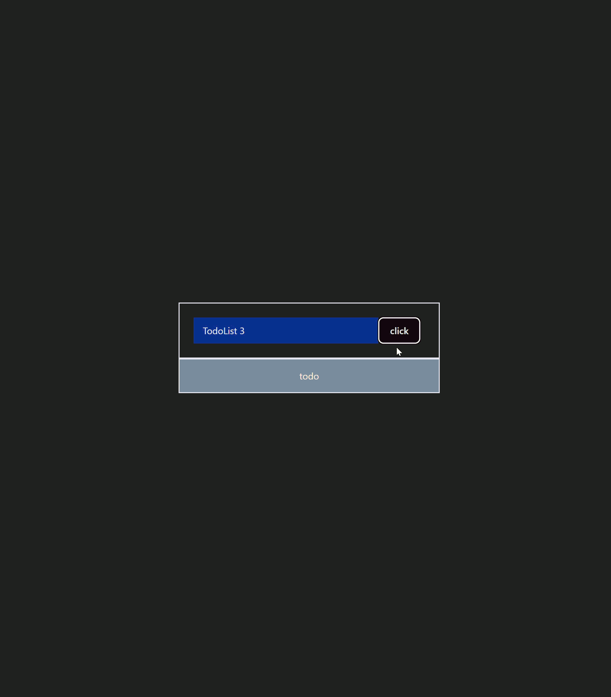

# React - testing out concepts

## TodoList 3

A simple todo list I created with vite, with the goal of learning React through applying my knowledge.

Technologies used:
- React 19
- vite 7
- Tailwindcss 4

## Lessons learned

- How to setup react + vite + tailwindcss
- How to setup nvm
- It is better to use the Tailwindcss package rather than the Tailwind one
- Update the state of an array through the pattern of (prev) => [...prev, {newObject}]
- Practice flex design again and its intricacies such as vertical and horizontal centering of items, and how they occupy the space
- Learn about the right use cases for adding custom CSS in Tailwind (docs) 

# Default React + Vite documentation

# React + Vite

This template provides a minimal setup to get React working in Vite with HMR and some ESLint rules.

Currently, two official plugins are available:

- [@vitejs/plugin-react](https://github.com/vitejs/vite-plugin-react/blob/main/packages/plugin-react) uses [Babel](https://babeljs.io/) for Fast Refresh
- [@vitejs/plugin-react-swc](https://github.com/vitejs/vite-plugin-react/blob/main/packages/plugin-react-swc) uses [SWC](https://swc.rs/) for Fast Refresh

## Expanding the ESLint configuration

If you are developing a production application, we recommend using TypeScript with type-aware lint rules enabled. Check out the [TS template](https://github.com/vitejs/vite/tree/main/packages/create-vite/template-react-ts) for information on how to integrate TypeScript and [`typescript-eslint`](https://typescript-eslint.io) in your project.
